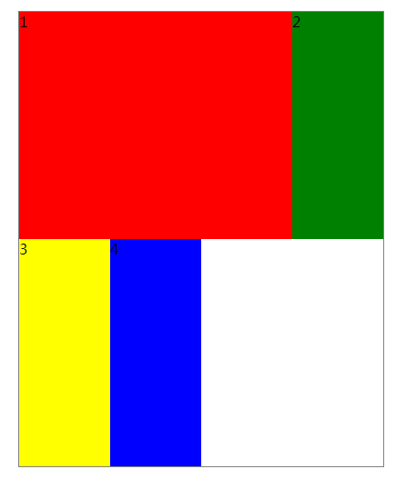
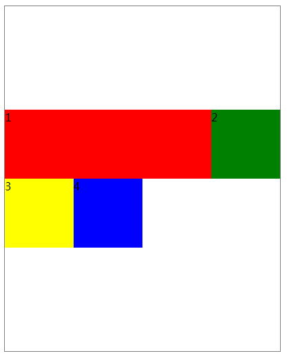
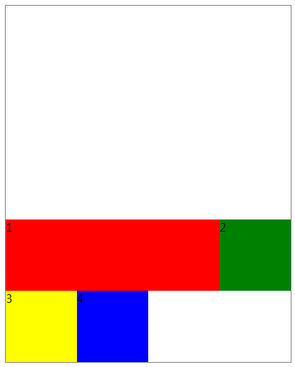
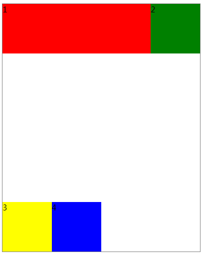
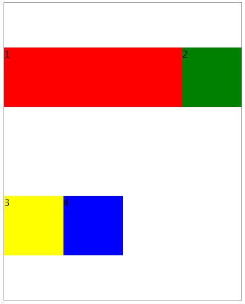
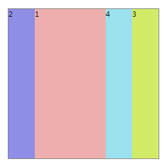
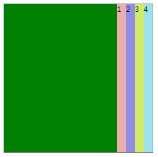
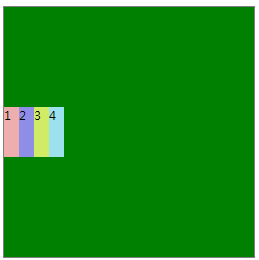
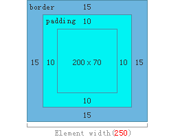

# CSS3
### CSS3简介

CSS 用于控制网页的样式和布局,CSS3 是最新的 CSS 标准。 

 [CSS速查手册](E:\总结\markdown\_res_css4.2.7.chm)

### 新增选择器
#### 关系选择器  
- `E~F` 选择E元素后面的所有兄弟元素F，元素E与F必须同属一个父级。
#### 属性选择器 
- `E[att^="val"]`  选择具有att属性且属性值为以val开头的字符串的E元素。
- `E[att$="val"]`  选择具有att属性且属性值为以val结尾的字符串的E元素。
- `E[att*="val"]`   选择具有att属性且属性值为包含val的字符串的E元素。
#### 伪类选择器
- `E:not(s)` 匹配不含有s选择符的元素E。
- `E:last-child` 匹配父元素的最后一个子元素E。
- `E:nth-child(n)` 匹配父元素的第n个子元素E，假设该子元素不是E，则选择符无效。
- `E:enabled` 匹配用户界面上处于可用状态的元素E。
- `E:disabled` 匹配用户界面上处于禁用状态的元素E。
- `E:checked` 匹配用户界面上处于选中状态的元素E。(用于input type为radio与checkbox时)
#### 伪对象选择器
- `E:before/E::before` 设置在对象前（依据对象树的逻辑结构）发生的内容。用来和content属性一起使用，并且必须定义content属性。
- `E:after/E::after` 设置在对象后（依据对象树的逻辑结构）发生的内容。用来和content属性一起使用，并且必须定义content属性。
- `E::placeholder` 设置对象文字占位符的样式。
- `E::selection` 设置标签中文本被选中的样式，只支持background-color，color及text-shadow(IE11尚不支持定义该属性)。

> CSS3将伪对象选择器前面的单个冒号(:)修改为双冒号(::)用以区别伪类选择器但以前的写法仍然有效。

###弹性盒子(重点)
CSS3 弹性盒（ Flexible Box 或 flexbox），是一种当页面需要适应不同的屏幕大小以及设备类型时确保元素拥有恰当的行为的布局方式。使用弹性盒子可以更加有效的方式来对一个容器中的子元素进行排列、对齐和分配空白空间。
**设置元素为弹性盒子使用属性 display:flex或者 display:inline-flex。**
>弹性盒子分为 容器 与 子元素， 当标签设置属性display:flex后那么该元素就是弹性盒子容器。元素内部**直接**子级标签就是子元素，通常情况下需要分别为容器与子元素设置属性。

#### 一、 弹性盒子容器常用属性
- `flex-direction` 决定子元素的排列方向。
  - `row` 默认值。子元素排成一行，排列顺序从左往右，紧靠左上角。
  - `row-reverse` 与 row 相同，但是以相反的顺序，紧靠右上角。
  - `column` 子元素排成一列，排列顺序从上到下，紧靠左上角。
  - `column-reverse` 与 column 相同，但是以相反的顺序，紧靠左下角。


- `flex-wrap` **规定flex容器是子元素宽度超过容器时是否换行。**

  - `nowrap` 默认值。规定元素不拆行或不拆列。

     

  - `wrap` 规定元素在必要的时候拆行或拆列。

    .webp) 

  - `wrap-reverse` 规定元素在必要的时候拆行或拆列，但是以相反的顺序。

  .webp)

- `flex-flow` flex-direction属性和flex-wrap属性的**简写形式**，默认值为row nowrap。

- `align-items` **定义flex子元素在flex容器的当前行的侧轴（纵轴）方向上的对齐方式。**

  - `stretch` 默认值。项目被纵向拉伸以适应容器。

  ###### *下面的选项不影响子元素大小*：

  - `center` 项目位于容器的中心。

  - `flex-start` 项目位于容器的开头。

  - `flex-end` 项目位于容器的结尾。

  - `baseline` 项目位于容器的基线上

     .png)	

- `align-content*` **修改` flex-wrap` 属性的行为，类似 `align-items`, 但不是设置子元素对齐，而是设置行对齐。这与调准伸缩项目在主轴上对齐方式的 <' justify-content '>  属性类似。请注意本属性在只有一行的伸缩容器上没有效果。**

  > **注意**：如果`flex-wrap : nowrap;`或者内容只有一行时，该属性效果不会显示。

  - `stretch` 默认值。各行将会伸展以占用剩余的空间。 

  

  - `center` 各行向弹性盒容器的中间位置堆叠。 

  

  - `flex-start` 各行向弹性盒容器的起始位置堆叠。

     

  - `flex-end` 各行向弹性盒容器的结束位置堆叠。

     

  - `space-between`各行在弹性盒容器中平均分布。

     

  - `space-around` 各行在弹性盒容器中平均分布，两端保留子元素与子元素之间间距大小的一半。 

    

- `justify-content` **设置弹性盒子元素在主轴（横轴）方向上的对齐方式**。

  - `flex-start` 默认值。项目位于容器的开头。

  - `flex-end` 项目位于容器的结尾。

  - `center` 项目位于容器的中心。

  - `space-between` 项目位于各行之间留有空白的容器内。

  - `space-around` 项目位于各行之前、之间、之后都留有空白的容器内。

    .png)

#### 二、 弹性盒子子元素属性

- `order` **设置弹性盒子的子元素排列顺序。**

  .png)

- `flex-grow` **设置或检索弹性盒子元素的扩展比率。**

  .webp)

- `flex-shrink` **子元素的收缩比率。**指定了 flex 元素的收缩规则。flex 元素仅在默认宽度之和大于容器的时候才会发生收缩，其收缩的大小是依据 flex-shrink 的值。

  .webp)

- `flex-basis` **用于设置或检索弹性盒伸缩基准值。**

- `flex` flex-grow、flex-shrink 和 flex-basis 属性的**简写属性**。

- `align-self` **在弹性子元素上使用**。覆盖容器的 align-items 属性。

  - `auto` 默认值。元素继承了它的父容器的 align-items 属性。如果没有父容器则为 "stretch"。
  - `stretch` 元素被拉伸以适应容器。
  - `center` 元素位于容器的中心。
  - `flex-start` 元素位于容器的开头。
  - `flex-end` 元素位于容器的结尾。
  - `baseline` 元素位于容器的基线上。
  - `initial` 设置该属性为它的默认值。
  - `inherit` 从父元素继承该属性。

  .webp)

  *****

### 旧版弹性盒子模型(了解就行)

弹性盒子模型可以自由的排列元素的位置。可以通过设置 `display:-webkit-box;`或 `display:-webkit-inline-box;` 定义元素为弹性盒子。

##### 弹性盒子模型中使用到的属性

- `-webkit-box-orient`：当前盒子中子元素排列方向，取值： vertical、horizontal。
- `-webkit-box-direction`： 当前盒子中子元素排列顺序，取值：reverse、normal。
- `-webkit-box-ordinal-group`: 指定元素的排列顺序。取值为数字，从 1 开始计数。

```html
<!DOCTYPE html>
<html lang="zh">

<head>
    <meta charset="UTF-8">
    <title>Document</title>
    <style>
        ul {
            margin: 0;padding: 0;
            list-style-type: none;
        }

        .oldFlex {
            margin: 200px auto;padding: 0;
            width: 500px;height: 500px;
            border: 1px solid gray;
            background: green;
            display: -webkit-box;
            /* 元素垂直排列 */
            /* -webkit-box-orient: vertical; */
            /* 元素水平排列 */
            -webkit-box-orient: horizontal;
            /* 内部元素反序排列 */
            /* -webkit-box-direction: reverse;] */
            /* 内部元素正序排列 */
            /* -webkit-box-direction: normal; */
        }

        .flex-1 {
            /* width: 300px; height: 50px; */
            background: rgb(238, 174, 174);
            /*指定排列顺序*/
            -webkit-box-ordinal-group: 2;
            -webkit-box-flex: 3;
        }

        .flex-2 {
            /* width: 300px;height: 50px; */
            background: rgb(142, 142, 230);
            -webkit-box-ordinal-group: 1;
            -webkit-box-flex: 1;
        }

        .flex-3 {
            /* width: 300px;height: 50px; */
            background: rgb(210, 235, 102);
            -webkit-box-ordinal-group: 4;
            -webkit-box-flex: 1;

        }

        .flex-4 {
            /* width: 300px;height: 50px; */
            background: rgb(155, 225, 238);
            -webkit-box-ordinal-group: 3;
            /* -webkit-box-flex 按比例分配元素所点的空间大小。 */
            -webkit-box-flex: 1;
        }
    </style>
</head>

<body>
    <ul class="oldFlex">
        <li class="flex-1">1</li>
        <li class="flex-2">2</li>
        <li class="flex-3">3</li>
        <li class="flex-4">4</li>
    </ul>
</body>

</html>
```



- `-webkit-box-pack`: 盒子剩余空间管理水平方向，取值：
  - start 所有元素在左侧显示。
  - end 所有元素在右侧显示。
  - center 所有元素水平居中。
  - justify 所有元素平均分布。
- `-webkit-box-align`: 盒子剩余空间管理垂直方向，取值：
  - start 所有元素在顶部显示。
  - end 所有元素在底部显示。
  - center 所有元素垂直居中。

```html
<!DOCTYPE html>
<html lang="zh">

<head>
    <meta charset="UTF-8">
    <title>Document</title>
    <style>
        ul {
            margin: 0;padding: 0;
            list-style-type: none;
        }

        .oldFlex {
            margin: 200px auto;padding: 0;
            width: 500px;height: 500px;
            border: 1px solid gray;
            background: green;
            display: -webkit-box;
            /* 元素水平排列 */
            -webkit-box-orient: horizontal;
            /* justify 所有元素平均分布。*/
            /* -webkit-box-pack: justify; */
            /* start 所有元素在左侧显示。 */
            /* -webkit-box-pack: start; */
            /* center 所有元素水平居中。 */
            /* -webkit-box-pack: center; */
            /* end 所有元素在右侧显示。 */
            -webkit-box-pack: end;
        }

        .flex-1 {
            width: 30px; height: 500px;
            background: rgb(238, 174, 174);
            
        }

        .flex-2 {
            width: 30px;height: 500px;
            background: rgb(142, 142, 230);
            
        }

        .flex-3 {
            width: 30px;height: 500px;
            background: rgb(210, 235, 102);
            
        }

        .flex-4 {
            width: 30px;height: 500px;
            background: rgb(155, 225, 238);
            
        }
    </style>
</head>

<body>
    <ul class="oldFlex">
        <li class="flex-1">1</li>
        <li class="flex-2">2</li>
        <li class="flex-3">3</li>
        <li class="flex-4">4</li>
    </ul>
</body>

</html>
```



--------------------

###取值与单位

#### 长度
- `rem` 相当于长度单位。相对于根元素(即html元素)font-size计算值的倍数。
- `vm` 相对于视口的宽度。视口被均分为100单位的vw。
- `vh` 相对于视口的高度。视口被均分为100单位的vh。
#### 角度
- deg 度（Degrees）。一个圆共360度。
#### 时间
- `s` 秒 1s = 1000ms 。
- `ms` 毫秒

#### 颜色

- `RGBA(R,G,B,A)`
  - R： 红色值。正整数 | 百分数
  - G： 绿色值。正整数 | 百分数
  - B： 蓝色值。正整数 | 百分数
  - A： 透明度。取值0 - 1之间。
- `HSL(H,S,L)`
  - H：色调。0(或360)表示红色，120表示绿色，240表示蓝色，也可取其他数值来指定颜色。取值为：0 - 360
  - S：饱和度。取值为：0.0% - 100.0%
  - L：亮度。取值为：0.0% - 100.0%
- `HSLA(H,S,L,A)`
  - A：透明度。取值0 - 1之间。

#### 边框

- border-radius简写属性。定义元素的圆角
  - `border-top-left-radius`
  - `border-top-right-radius`
  - `border-bottom-right-radius`
  - `border-bottom-left-radius`

  

- `box-shadow` 定义元素的阴影 

#### 背景

- `background`简写属性。定义元素的背景特性
  - `background-image` 定义元素使用的背景图像
  - `background-position` 指定背景图像在元素中出现的位置
  - `background-repeat` 定义元素的背景图像如何填充
  - `background-attachment` 定义滚动时背景图像相对于谁固定
  - `background-size` 定义背景图像的尺寸大小

#### 文件

- `text-transform` 定义元素的文本如何转换大小写
- `text-shadow` 定义文字是否有阴影及模糊效果

------------

### 用户界面

- `resize` 是否允许缩放
- `zoom` 设置对象的缩放比例
- `box-sizing` 设置是否怪异盒模型

1. 标准盒模型

```css
.test1{
    box-sizing:content-box;
    width:200px;
    padding:10px;
    border:15px solid #eee;
}
```



2. 怪异盒模型

```
.test1{
    box-sizing:border-box;
    width:200px;
    padding:10px;
    border:15px solid #eee;
}
```

----------------------

### 渐变

- `linear-gradient()` 用线性渐变创建图像。
- `radial-gradient()` 用径向渐变创建图像。

```css
.box{
    width: 250px; height: 250px;
    background: red;
    border-radius: 50%;
    /* 直径100px位置 左上35%  */
    background: radial-gradient(circle 100px at 35% 35%,  #fff,  #ff0);
    box-shadow: 0 0 8px #ff0;
}
```

-----------------------

### 过渡

- `transition` 复合属性。设置对象变换时的过渡效果
- `transition-duration` 设置过渡的持续时间
- `transition-property` 设置对象中的参与过渡的属性
- `transition-delay` 设置对象延迟过渡的时间
- `transition-timing-function`： 检索或设置对象中过渡的动画类型 

-------------------

### 2d3d变换

转换是CSS3中新特征之一，可以实现元素的位移、旋转、变形、缩放，等动画效果

- `transform `
  - 2D变化
    - `scale()` 2D缩放
    - `translate()` 2D平移
    - `rotate()` 2D旋转
    - `skew()` 斜切扭曲
  - 3D变化
    - `rotatex()` 指定x轴上的旋转角度
    - `rotatey()` 指定y轴上的旋转角度
    - `rotatez()` 指定z轴上的旋转角度

--------------------

### 动画

可通过设置多个节点来精确控制一个或一组动画，常用来实现复杂的动画效果。 

- `animation` 复合属性。设置对象所应用的动画特效。
- `@keyframes` 指定动画名称和动画效果。 (必选)
  - `from/to` 从一种状态过渡到另一种状态
  - `percentage` 百分比
- `animation-duration`检索或设置对象动画的持续时间。 (必选)
- `animation-name` 设置对象所应用的动画名称。(必选)

下面属于可选属性：

- `animation-timing-function` 设置对象动画的过渡类型。
- `animation-delay` 设置对象动画延迟的时间。
- `animation-iteration-count` 设置对象动画的循环次数。
- `animation-direction` 设置对象动画在循环中是否反向运行。
- `animation-fill-mode` 检索或设置对象动画时间之外的状态。

可以借助插件[Animate.css](https://animate.style/ )

---------------------

### 媒体查询（理解就行）

在CSS2中媒体查询可以针对不同的媒体类型(包括显示器、便携设备、电视机，等等)设置不同的样式规则。但是这些多媒体类型在很多设备上支持还不够友好。css3在css2的基础之上改进了查找设备的类型，CSS3 根据设置自适应显示。媒体查询可用于检测很多事情，例如：viewport(视窗) 的宽度与高度、设备的宽度与高度、朝向 (智能手机横屏，竖屏) 、分辨率。 

`@media` 指定样式表规则用于指定的媒体类型和条件。 

```css
@media screen and (max-width: 300px) {
    body {
        background-color:lightblue;
    }
}
```

##### 媒体查询弊端：

为了适配更多的设备（移动端），我们在CSS会加入大量的`@media`,可是用户每个人的移动设备不需要这些多余的样式,导致数据变大,文档累赘。导致在网络状态不好时会时的文档加载过慢，影响用户体验，所以出现了一种新的方法来解决这个弊端。

--------------------

### 字体图标库

字体图片库可以在让在页面中设置图标颜色大小像设置文本一样便捷。 推荐使用 [阿里巴巴矢量图标库](https://www.iconfont.cn/) 