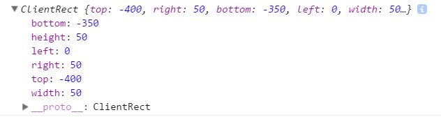
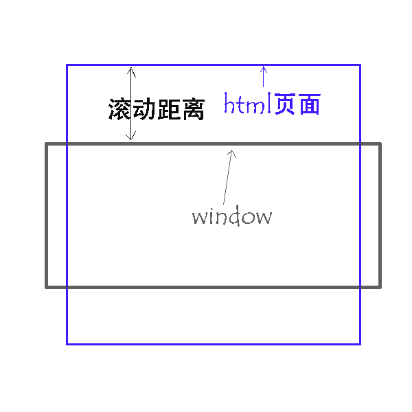

# DOM

###DOM的定义

1. DOM（Document Object Model——文档对象模型）是用来呈现以及与任意 HTML文档交互的API（接口）。
2. DOM 是载入到浏览器中的文档模型，以**节点树**的形式来表现文档，每个节点代表文档的构成部分（例如:页面元素、字符串或注释等等）。
3. DOM允许运行在浏览器中的代码访问文件中的节点并与之交互。节点可以被创建，移动或修改。事件监听器可以被添加到节点上并在给定事件发生时触发。 

> DOM的作用就是搭建JS与HTML沟通的桥梁，即JS通过操作DOM树来动态生成和删除HTML元素

### 获取HTML元素

1. `document.getElementById()` 根据元素的 **id** 属性值获取节点。 
2. `document.getElementsByClassName()` 根据元素的 **class** 属性值获取节点列表集合。 
3. `document.getElementsByTagName()`根据**元素名**获取节点列表集合。 
4. `document.getElementsByName()`根据元素的 **name** 属性值获取节点列表集合。H5新特性。 
5. `document.querySelector(selectors)`返回文档中与指定选择器或选择器组匹配的第一个 html元素Element。 如果找不到匹配项，则返回null。H5新特性。 
6. `document.querySelectorAll(selectors)` 返回与指定的选择器组匹配的文档中的元素列表 (使用深度优先的先序遍历文档的节点)。返回的对象是 NodeList 。H5新特性。 

###节点类型

`element.nodeType`属性可以获取元素的类型。可用来区分不同类型的节点，比如 元素, 文本 和 注释，**只读属性**。 

| 节点类型 |           描述            |
|:--------:| :-----------------------: |
| 1        |           元素            |
| 2        |           属性            |
| 3        |           文本            |
| 8        |           注释            |
| 9        | 整个文档（DOM树的根节点） |
| 8        |           注释            |

### 节点名称

`element.nodeName`返回当前节点的节点名称,**只读属性**。 返回值为所有字母都为大写字母的元素名。

### 获取子节点及兄弟节点

####获取子节点和兄弟节点方式一：

1. `element.childNodes`获取子节点 
2. `element.firstChild`获取第一个子节点。 
3. `element.lastChild` 获取最后一个子节点 
4. `element.nextSibling`获取当前节点的下一个兄弟节点。 
5. `element.previousSibling`获取当前节点的上一个兄弟节点。 

> 注意以上5个属性在标准浏览器会获取空白节点（空白节点其它也是文本节点）而在IE5/6/7/8下则不会获取空白节点。

#### 获取子节点和兄弟节点的方式二：

1. `element.children` 获取子节点。 
2. `element.firstElementChild`获取第一个子节点。 
3. `element.lastElementChild`获取最后一个子节点。 
4. `element.nextElementSibling`获取当前节点的下一个兄弟节点。 
5. `element.previousElementSibling`获取当前节点的上一个兄弟节点。 

> 以上5个属性在使用的时候不会获取空白节点。但是要注意除了children支持所有浏览器外其属性是不支持IE5/6/7/8浏览器的。 

####**兼容IE低版本的写法**（重点）

```js
function firstNode(obj) {
    return obj.firstElementChild || obj.firstChild;
}
function lastNode(obj) {
    return obj.lastElementChild || obj.lastChild;
}
function nextNode(obj) {
    return obj.nextElementSibling || obj.nextSibling;
}
function prevNode(obj) {
    return obj.previousElementSibling || obj.previousSibling;
}
```

#### 父级节点

- `element.parentNode`当前节点的父节点。
- `element.offsetParent`获取当前节点的祖先节点。

> 标准浏览器在获取祖先节点时有两种情况：
>
> 1. 如果所有父级节点都没有定位，那么获取到的祖先节点就是`<body>`。
> 2. 如果父级节点中有定位(固定、相对、绝对)，那么获取的的节点就是离他最近的定位节点。 

### 元素操作

- **`document.createElement()`**创建元素节点。
- `document.createTextNode()`创建文本节点。
- `document.createAttribute()`创建一个属性节点。
- **`element.appendChild()`**为元素添加一个新的子元素。
- **`element.replaceChild（）`**替换一个子元素。
- `element.inserBefore()`现有的子元素之前插入一个新的子元素 。
- `element.innerHTML`设置或者返回元素内容。（慎用，会改变HTML的格局）
- `element.innerText` 设置或者返回元素的内容。 （慎用，会将文本内容改变）
- `element.className ` 设置或返回元素的class属性。
- `element.id`  设置或返回元素的 id。 
- `element.setAttribute() ` 把指定属性设置或更改为指定值。 
- `element.style`  设置或返回元素的 style 属性。 
- `element.title`  设置或返回元素的title属性。
- `element.tagName`  返回元素的标签名。

### 元素克隆

- `element.cloneNode()`  克隆元素。
  -  接收一个布尔值的参数默认为false。
  - 如果为布尔值为true,则该节点的所有后代节点也都会被克隆,如果为false,则只克隆该节点本身。 

### 批量添加元素（学会使用文档碎片方式）

- 普通添加

  ```html
  <!-- 为ul添加子元素 -->
  <ul id="box"></ul>
  <script>
  let box = document.getElementById("box"); 
  for(let i=1;i<=100;i++){
      ley li = document.createElement("li");
      li.innerHTML = i;
      box.appendChild(li);
  }
  </script>
  ```

- > 普通模式下频繁操作DOM树，效率低。 

- 使用文档碎片方式添加

  ```js
  let box = document.getElementById("box"); 
  // 创建文档碎片    
  let fragment = document.createDocumentFragment();
  let li = document.createElement("li");
  // 将新元素添加到文档碎片中
  for(let i=1;i<=100;i++){
      let liclone =li.cloneNode(true) ;
      liclone.innerHTML = i;
      fragment.appendChild(liclone);
  }
  //将文档碎片添加到 ul 元素。
  box.appendChild(fragment);
  ```

- > 使用Fragment时会将需要添加的元素一次性添加到DOM树中，效率更高。

### 事件

#### 鼠标事件，键盘事件

1. 常用键盘事件：`onkeydown`键盘按下、`onkeyup`键盘松开，`onkeypress`键盘按下松开时（类似数字电路中的上升沿触发或下降沿触发）。 
2. 常用的鼠标事件：`onclick`单击、`ondblclick`双击、`onmousedown`鼠标按下、`onmouseup`鼠标松开、`oncontextmenu`鼠标右键、`onmousemove`鼠标移动等...。 

#### 事件对象event

event对象：连接**事件与事件细节的桥梁**。其实就是鼠标事件中鼠标在屏幕的哪个位置触发的该事件，键盘事件中你按下的是哪个按钮触发的该事件等这些事件的细节。 

##### 获取event对象的两种方法：

1. window.event(firefox不支持)

   ```js
   document.onclick = function () {
       console.log(window.event);
   }
   ```

   > window.event必须写在事件函数中，如果写在普通函数中将获取不到。 

2. 事件函数中的第一个参数（IE 5/6/7/8不支持）。 

   ```js
   document.onclick = function (event) {
       console.log(event);
   }
   ```

3. event 兼容性写法

```js
document.onclick = function (event) {
    let ev = event || window.event;
    console.log(ev);
}
```

##### 鼠标事件event对象中常用属性。

- `event.clientX` :事件在触发时鼠标所在的X轴位置,需要注意这个位置是相对于整个窗口可视区域的，窗口可视区域最左侧为0坐标。
- `event.clientY` :事件在触发时鼠标所在的Y轴位置
- `event.x / event.y `:作用和 `event.clientX | clientY `相同，但需要注意在IE5/6/7时`event.x | y`要比` event.clientX | clientY` 少两像素。
- `event.pageX` :鼠标相对于整个页面窗口的X轴位置。
- `event.pageY` :鼠标相对于整个页面窗口的Y轴位置。

> `event.pageX/event.pageY`:IE5/6/7/8不支持。 

##### 键盘事件中的event对象

事件对象` event.keyCode` 可以获取按下的按键是什么，注意`event.keyCode`返回的是一个数字。键盘上的每一个按键就有一个独一无二的数字编码。 键盘的CTRL、SHIFT、ALT,在event事件对象中分别对应`event.ctrlKey`、`event.shiftKey`、`event.altKey`，如果对应的按键按下该属性返回true否则返回false。当然也可以通过`event.keyCode`获取它们的数字编码。 

##### 事件源

- `event.target`：事件源，(触发的事件的元素)IE5/6/7/8不支持该属性。 
- `event.srcElement`：事件源，IE5/6/7/8支持该属性。 

#### 阻止事件的默认行为(重点)

部分事件中会有默认的行为，这些并不是我们需要的，比如上下文菜单（`oncontextmenu`），表单提交（`onsubmit`），如果要阻止这些默认行为可以使用 `event.preventDefault()`。

```js 
 document.querySelector('body')
    .oncontextmenu = function (ev) {
        // 阻止默认事件
        ev.preventDefault()
    }

document.querySelector('.testForm')
    .onsubmit = function (ev) {
        // 阻止表单默认事件
        ev.preventDefault()
    }
```

> `event.preventDefault()` 不支持IE浏览器 ，IE使用 `return false` 

#### 事件冒泡与事件捕获(重点)

**事件流**是  JS  中事件的一种现象。事件流有两种：事件冒泡和事件捕获。

- **事件冒泡是从内向外传递将事件层层传递，而捕获是从外向内传递事件。**捕获与冒泡不能同时存在，**只能二先一**。
- IE5/6/7/8不支持事件捕获。普通事件只支持冒泡（如：`onclick`、`ondblclick`...）只有绑定事件才有捕获现象。
- **阻止事件冒泡有两种方法（重点）**
  - `event.cancelBubble = true;` 支持IE。
  - `event.stopPropagation();` IE5/6/7/8不支持这种写法。

####绑定事件

**绑定事件的特点可以让一个元素同时拥有相同事件类型的事件两个及以上事件**，而普通事件添加方式是只能拥有一个相同事件类型的事件。 

```js
var box1 = document.getElementById("box1");
var box2 = document.getElementById("box2");
//添加普通事件
box1.onclick = aa;
box1.onclick = bb;
//以绑定事件的方式添加
box2.attachEvent('onclick',aa);
box2.attachEvent('onclick',bb);
function aa(){
    alert('aaa');
}
function bb(){
    alert('bb');
}
```

> 上面示例在 IE5/6/7/8/9/10 下运行。 

##### 绑定事件有两种方式：

1. `attachEvent(eventName,callback)` : 支持 IE5/6/7/8/9/10。为一个元素绑定事件。

   - `eventName` 第一个参数是事件名称。
   - `callback` 第二个参数为事件回调函数。

   > 注意该方法不支持标准浏览器和IE11.

2. `addEventListener(type, listener, options)`: 支持标准浏览器和IE9/10/11,

   - type 参数一：事件名称，这里需要注意正常情况下 JS 中的事件就是以on开头的，如`onclick`、`ondblclick`，但在这个方法中要写成`click`或`dblclick`去掉on。
   - `listener` 参数二：事件回调函数。
   - `options` 参数三：`boolean`值,为`true`时捕获，`false`时冒泡。

- 绑定事件兼容性写法

```js
/*
* 参数1：要绑定事件的元素。
* 参数2：要绑定的事件名称。
* 参数3：要绑定事件回调。
*/
function bindEvent(obj,eventName,callback){
    if(obj.addEventListener){
        obj.addEventListener(eventName,callback,false);
    }else{
        obj.attachEvent("on"+eventName,callback);
    }
}
```

> 注：`attachEvent()`绑定事件中如果内部使用了this指针那么需要注意this的指向问题，在IE5/6/7/8/9/10中this并不是指定元素本身，而是指向了window对象。

##### 取消普通事件和绑定事件（重点）

- **取消普通事件：`xx.onclick = null`。**
- **IE5-10使用`attachEvent()`绑定事件那么就要使用` detachEvent()`取消事件绑定。**
- **标准浏览器使用`addEventListener()`绑定事件，使用`removeEventListener()`取消事件绑定。**

```js
// 兼容性写法：
function delEvent(obj,eventName,callback){
    if(obj.removeEventListener){
        obj.removeEventListener(eventName,callback,false);
    }else{
        obj.detachEvent('on'+eventName,callback);
    }
}

```

#### 事件委托

事件委托：可以让后续添加的元素直接拥有事件的形为，也就是直接就拥有事件，而不需要再单独指定事件。简单来说，就是我们在父级元素上添加了事件，那么后续给在这个父级元素上添加的所有子级元素都会拥有这个事件。

```html
<ul id="mul">
    <li>苹果</li>
    <li>香蕉</li>
    <li>草莓</li>
    <li>樱桃</li>
</ul>
<script>
    var mUl = document.getElementById("mul");
    var lis = document.getElementsByTagName("li");

    mUl.onclick = function(ev){
       var event = ev ||window.event;
        //获取事件源
        var target = event.target || event.srcElement;
        // 必须是由li触发
        if("li" == target.nodeName.toLowerCase()){
           alert(target.innerHTML);
        }
    }
</script>
```

**事件委托其实就是利用事件冒泡现象实现的，这样作有两个好处：**

1. **效率高：如果有大量的元素需要添加相同的事件时不必为每一个元素单独添加事件。**
2. **后续加入的元素也可以直接拥有事件，不需要再为新元素添加事件。而普通事件就不可以，必须为新元素再次指定事件。**

> 1. 要注意事件委托利用的是冒泡原理，那么就需要该事件必须支持冒泡。
> 2. 由于使用事件委托时其所有的子元素及其本身都可以触发该事件方法，所在必须检查触发元素是否是想要的事件元素。

###元素距离及可视距离的计算

元素到浏览器窗口左侧、顶部的距离的计算方法及兼容性问题

- `element.offsetLeft` 计算元素到左侧的距离，需要注意的是` offsetLeft` 同`offsetParen`一样会受到父级节点中定位的影响，如果父级中有定位的，那么获取的距离是该元素到定位元素的距离。如果父级中没有定位样式，那么获取到的距离是该元素到 HTML 元素的距离。

```html
<style>
    *{margin: 0;padding: 0;}
    #div1,#div2,#div3{padding: 50px;}
    #div1{background: red;}
    #div2{background: green;}
    #div3{background: blue;}
    body{padding: 20px;}
    html{padding: 10px;}
</style>

<div id="div1">
    <div id="div2">
        <div id="div3"></div>
    </div>
</div>

<script>
    var div3 = document.getElementById('div3');
    console.log(div3.offsetLeft);
</script>
```

> 在上面代码放在标标准浏览器及IE高版本浏览器中运行输出结果为： 130(div2 50 div1 50 body 20 　html 10)。 而在 IE5/6/7 中运行结果为：120(div2 50 div1 50 body 20)。标准浏览器及IE高版本中父级无定位计算的距离到 html 标签，IE5/6/7父级无定位计算的距离到 body 标签。 

- `offsetLeft`在IE5/6/7中还需要注意以下几个兼容性问题 

```html
<style>
    *{margin: 0;padding: 0;}
    #div1,#div2,#div3{padding: 50px;}
    #div1{background: red;}
    #div2{background: green;}
    #div3{background: blue;}
    body{padding: 20px;}
    html{padding: 10px; }
</style>

<div id="div1" style="position: absolute">
    <div id="div2">
        <div id="div3"></div>
    </div>
</div>

<script>
    var div3 = document.getElementById('div3');
    console.log(div3.offsetLeft);
</script>
```

1. 当前元素没有定位，父级元素 `#div2` 定位样式值为 `absolute` 在IE5/6/7中输出结果：100。
2. 当前元素没有定位，父级元素 `#div2` 定位样式值修改为 `relative` 在IE5/6/7中输出结果：120。很显然计算的距离到` <body>` 标签。
3. 在父级元素中加入可以触发haslayout 的样式，修改如下：

```html
<div id="div1" style="position: relative" >
    <div id="div2" style="zoom:1" >
        <div id="div3"></div>
    </div>
</div>
```

IE5/6/7中输出结果：50。需要注意在 IE 低版本时计算距离会受到 haslayout 的影响。 

4. 当前元素中加入定位样式，修改如下： 

```html
<div id="div1" style="position: relative" >
    <div id="div2" style="zoom:1" >
        <div id="div3"style="position: relative"></div>
    </div>
</div>
```

IE5/6/7中输出结果：120。注意元素 #div1 使用的是相对定位 relative 。如果换成 absolute 绝对定位，那么输出结果：100。#div2 中触发 haslayout 的样式并没有影响到距离的计算。

5. 当前元素中加入定位样式，父级元素中去掉定位及触发 haslayout 的样式修改如下：

   ```html
   <div id="div1"  >
       <div id="div2" >
           <div id="div3"style="position: relative"></div>
       </div>
   </div>
   ```

​        IE5/6/7中输出结果：130，#div3 定位值修改为 absolute 时输出结果依然是130,并没有受影响。 

6. 当前元素加入定位样式，父级元素中加入定位 

```html
<div id="div1" style="position: relative" >
    <div id="div2" >
        <div id="div3"style="position: absolute"></div>
    </div>
</div>
```

​       IE5/6/7中输出结果：120。 #div3 定位值修改为 relative 输出结果为 100。 

> 注意，offsetLeft/offsetTop 在 IE6/7 低版本有很大的兼容性问题，使用时需要注意。 

- `element.offsetTop` 计算当前元素到顶部的距离。兼容性问题和 `offsetLeft` 相同。
- 获取元素到左侧和顶部的距离方法封装

```js
function getLeft(element){
    var result = 0;
    while(element){
        result  += element.offsetLeft;
        element = element.offsetParent;
        
    }
    return result;
}
function getTop(element){
    var result = 0;
    while(element){
        result += element.offsetTop;
        element = element.offsetParent;
        
    }
    return result;
}
```

> 以上两个方法在可以解决大部分浏览器中获取元素到左侧或顶部的距离。但是在 IE6/7 自身有定位，父级元素中有定位并且定位值`relative`那么就会多加一个定位元素到 `body` 的距离。  

### 可视区

- `Element.getBoundingClientRect() `获取元素的可视区对象 `ClientRect` 。 `ClientRect` 对象中有以下几个属性 
  - top 元素顶部到可视区顶部的距离。
  - bottom 元素底部到可视区顶部的距离。
  - left 元素左侧到可视区左侧的距离。
  - right 元素右侧到可视区左侧的距离。
  - height 元素的高。
  - width 元素的宽。 




#### 滚动距离

window窗口在向上滚动时被遮挡部分离可视窗口的距离。 



- `window.pageYOffset `获取或设置窗口的垂直滚动距离，不支持IE6/7/8。
- `window.pageXOffset`获取或设置窗口的水平滚动距离，不支持IE6/7/8。
- `document.documentElement.scrollTop` 获取窗口的垂直滚动距离，支持IE及 firefox 火狐浏览器。
- `document.documentElement.scrollLeft` 获取窗口的水平滚动距离，支持IE及 firefox 火狐浏览器。
- `document.body.scrollLeft` 设置或获取窗口的水平滚动距离，支持 chrome 谷歌 opera 欧朋浏览器。
- `document.body.scrollTop` 设置或获取窗口的垂直滚动距离，支持 chrome 谷歌 opera 欧朋浏览器。

##### 获取滚动距离兼容性写法：

```js
function setScrollX(num){
    document.documentElement.scrollLeft = document.body.scrollLeft = num;
}
function setScrollY(num){
    document.documentElement.scrollTop = document.body.scrollTop = num;
}
```

> `scrollTop`,`scrollLeft`不但可以获取整个页面的滚动距离，也可以获取元素的滚动距离。 

### cookie

Cookie 并不是它的原意“甜饼”的意思, 而是一个保存在客户机中的简单的文本文件, 是一段不超过4KB的小型文本数据，由一个名称（Name）、一个值（Value）和其它几个用于控制Cookie有效期、安全性、使用范围的可选属性组成。不同的域名下会保存不同的cookie，并且互相不同访问。cookie会随请求往返于服务器与客户端，两者都可以操作cookie。

- `document.cookie` 设置或返回与当前文档有关的所有 cookie。 

```js
/**
* 设置cookie
* @param {String} name  cookie名称
* @param {String} value cookie值
* @param {Number} time 过期时间 分钟
*/
function setCookie(name, value, minute){
    let va = escape(value)
    let data = new Date()
    if (minute) {
        data.setTime(data.getTime() + 1000 * 60 * minute)
        document.cookie = `${name}=${va};expires=${data.toUTCString()}`
    } else {
        document.cookie = `${name}=${va}` //当前会话关闭就超时
    }
}

/**
 * 删除指定cookie
 * @param {String} name 要删除的cookie名称
 */
function clearCookieByName(name){
    setCookie(name, '', -1)
}


/**
 * 获取所有cookie
 * return 包含当前cookie值的对象 
 */
function getCookieAll(){
    let coo = document.cookie
    if (coo == '') {
        return null
    }
    //清除空格
    coo = coo.replace(/\s+/g, '')
    let cArr = coo.split(';')
    let cookies = {}
    cArr.forEach((coo) => {
        let c = coo.split('=')
        cookies[c[0]] = unescape(c[1])
    })
    return cookies
}

/**
 * 获取指定名称的cookie
 * 参数name: cookie名称
 * return :如果有返回cookie值，否则返回为null
 */
function getCookieByName(name){
    let cs =  getCookieAll()
    
    if(cs.hasOwnProperty(name)){
        return cs[name]
    }else {
        return null
    }
}
```