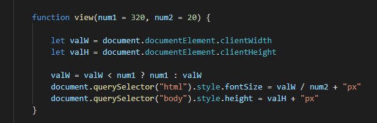

# 移动端开发

移动端是指手机，平板电脑等移动设备，移动端开发是指将网页运行在移动端设备上。
> 注意:笔记本电脑不是移动端,是属于个人电脑。

由于移动端大部分都是屏幕比笔记本小，内存和CPU的运算量不能过大，导致网页的一些特效无法完全应用，为了让用户有更好的体验，需要对网页做适当的“减法”，让文档加载更快，文档的功能更强大。但这是矛盾的且不现实，只能在中间适当取舍。

现在主流两种移动端开发：

- 响应式开发：利用媒体查询，让文档html能够适配各种手机，平板等众多移动设备。但媒体查询有一个弊端，为了适配多个尺寸不同的移动端设备，会添加多个媒体查询，导致文档过大，而且每一台移动端设备只能适配一个媒体查询，导致资源的浪费，所以不推荐使用。
- `rem`+`flex`移动端适配：利用C3中rem和flex属性,可以对文档进行动态改变尺寸大小,但由于在赋值时需要将`px`单位转`rem`比较繁琐,可以利用插件来改变这种情况。下面会进行更详细的介绍。


> 知识扩展：有一些需要实时更新文档的软件，如淘宝，京东等等都用到了安卓的`webview`控件。具体需要网上了解。

### `rem`+ `flex`移动端适配

`rem`相对长度单位，相对于根元素(即html元素)`font-size`计算值的倍数。`rem` 移动端屏幕适配是通过计算屏幕尺寸设置根元素字体大小，页面中所用单位统统使用 `rem`作为单位，这样只要改变根元素字体大小页面中所有元素都会发生改变。`flex`可以简便、响应式地实现各种页面布局。

> 为了便于计算 `rem` 在使用 vscode 编辑器时可以安装 `px to rem` 插件 。

```html
<head>
    <meta charset="UTF-8">
    <!-- 第一步：视口 width=device-width 初始化比例为1 不缩放 禁止用户缩放  -->
    <!-- viewport-fit=cover" iphoneX 前刘海的适配问题 -->
    <!-- name="format-detection" -->
    <meta name="viewport" content="width=device-width, initial-scale=1.0, user-scalable=no,viewport-fit=cover">
    <meta http-equiv="X-UA-Compatible" content="ie=edge">
    <!-- 在苹果手机设备上 会把一些电话号码自动识别 可拨打的手机号，会有链接 设为no 取消 -->
    <meta name="format-detection" content="telephone=no" />
    <!-- yes显示 苹果手机的工具栏和菜单栏 -->
    <meta name="apple-mobile-web-app-capable" content="yes">
    <!-- 设置苹果手机设备的状态栏 为黑色 .默认值为default（白色），可以定为black（黑色）和black-translucent（灰色半透明） -->
    <meta name="apple-mobile-web-app-status-bar-style" content="black">
```

### 移动端设置

```html
<head>
    <meta charset="UTF-8">
    <!-- 第一步：视口 width=device-width 初始化比例为1 不缩放 禁止用户缩放  -->
    <!-- viewport-fit=cover" iphoneX 前刘海的适配问题 -->
    <!-- name="format-detection" -->
    <meta name="viewport" content="width=device-width, initial-scale=1.0, user-scalable=no,viewport-fit=cover">
    <meta http-equiv="X-UA-Compatible" content="ie=edge">
    <!-- 在苹果手机设备上 会把一些电话号码自动识别 可拨打的手机号，会有链接 设为no 取消 -->
    <meta name="format-detection" content="telephone=no" />
    <!-- yes显示 苹果手机的工具栏和菜单栏 -->
    <meta name="apple-mobile-web-app-capable" content="yes">
    <!-- 设置苹果手机设备的状态栏 为黑色 .默认值为default（白色），可以定为black（黑色）和black-translucent（灰色半透明） -->
    <meta name="apple-mobile-web-app-status-bar-style" content="black">
</head>
```

### 计算 `rem`

找到设备可视区的宽度,利用其计算根标签`html`的字体大小,用来决定后面设置的尺寸。



### 在手机上发生的事件

一个是`touch`事件（触摸），一个是`tap`事件（敲击），还有一个`swipe`事件（滑动）。借助一个插件[zepto](https://www.html.cn/doc/zeptojs_api/#css )可以加快对移动端的开发。详细使用方法可以阅读该网页。

